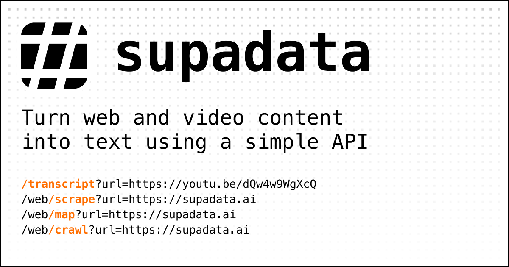

# FactCheckJS - Fact Check Youtube

FactCheck allows for fact checking youtube comments since their is a lot of fake news on youtube
FactCheck getFactCheck(videoId, maxComments) takes some time to response.


***Issues***

Github Issues (If You Have An Issue With The Package): https://github.com/Jamcha123/FactCheck/issues


***Installation***

``` npm install factcheckjs ```


***Initialization***: 

``` import FactCheck from 'factcheckjs' ```

``` const obj = new FactCheck({customerUID: "Your Customer UID"}) ```


***Getting A Customer UID And Subscribing To FactCheck API ($0.05 Per API Call, No Payment Upfront)***: 
   
   ```const checkout = await getCheckout()```
   
   ```console.log(checkout) //After you subscribe you have to put your customer UID in the new FactChect({customerUID: "Your Customer UID You Got From Subscribing"})```

   ``` const obj = new FactCheck({customerUID: "Add Your Customer UID"}) ``` 


***Main Function (new FactCheck({customerUID: "Your Customer UID"}))***: 

   ``` const getFactCheck = await getFactChecker(youtubeId, maxComments) ```

   ``` console.log(getFactCheck) //The Main Function For Fact Checking Youtube Comments (It Takes Some Time To Response) ```


***Response (Comment)***

   ```
      {
        name: [String],
        comment: [String],
        sources: [ [Object], [Object] ],
        pro: [
          [String], 
          [String], 
          [String], 
        ],
        anti: [
          [String], 
          [String], 
          [String], 
        ]
      },
   ```
   

***Optional Functions (new FactCheck({userkey: "Your UID Needed"}))***:

   ``` const getUsage = await getUsage() ```
   ``` console.log(getUsage) //Get Your Current Usage And How Much To Pay Per Week ```

   ``` const cancelSubscription = await cancelSubscription() ```
   ``` console.log(cancelSubscription) //Cancel Your Subscription ```


***Guide: Step By Step***

First, Get A UID Using The (await getLogin(email, password)) function and console.log.

Second, Add The UID Into The FactCheck Object Config: ``` new FactCheck({customerUID: 'Your Customer UID'}) ```

Thirdly, Use The UID To Subscribe To The FactCheck API Pay As You Go For $0.05 Per API Call 

Finally, You Can Use The Main Function: ```await getFactCheck(youtubeId, maxComments)``` And Get Your Fact Checked Response (It Takes Some Time To Response)

***Powered By Supadata***

**Get 100 Free API Requests (Build YouTube Apps) : [Supdata Website](https://supadata.ai/?ref=james*)* 

[](https://supadata.ai/?ref=james)